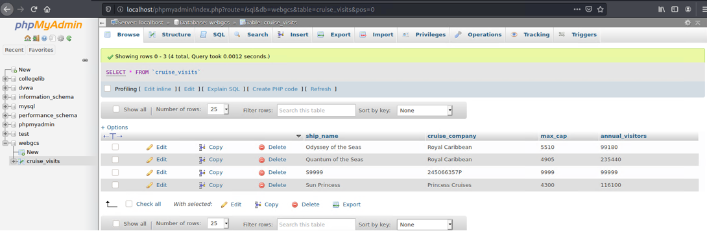
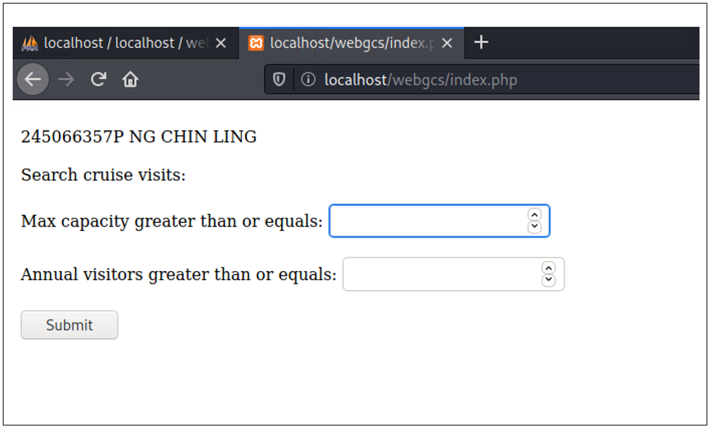
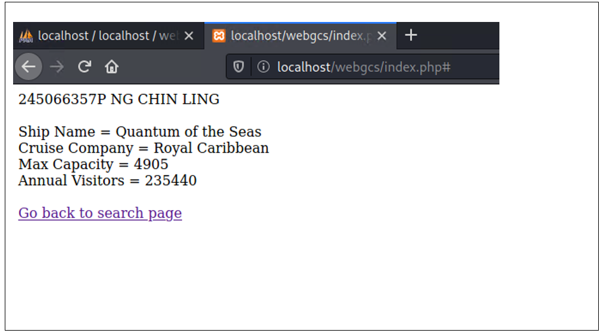

# PHP web project
This is a simple PHP project which uses the LAMPP stack. It displays a search form for cruise ship arrivals, where the cruise ship information is stored in a MySQL database.

1. Cruise ship information in MySQL (accessed with phpMyAdmin)

2. Search form

3. Results

